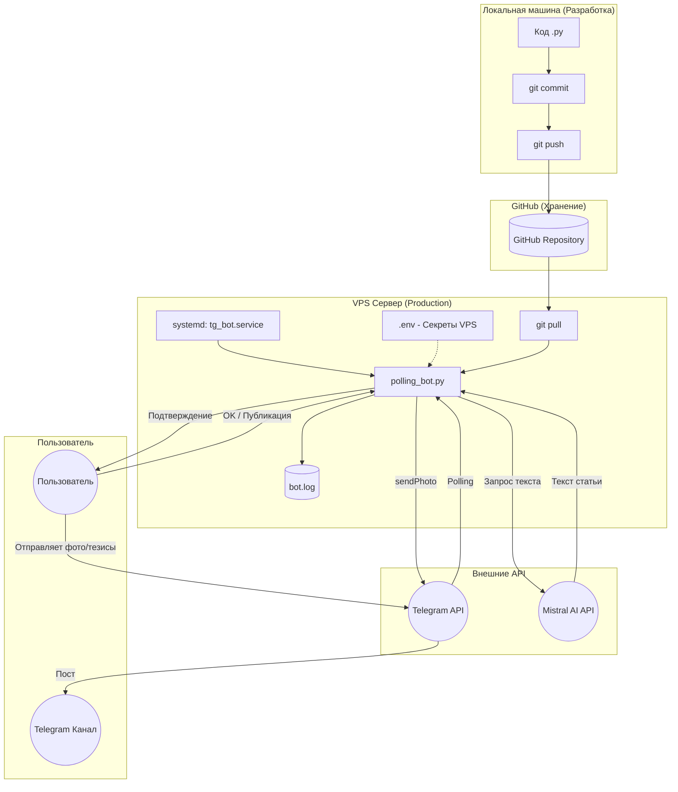

# Telegram Publisher

Telegram Publisher — сервис для публикации постов в Telegram‑канал по фотографии и тезисам.

Бот принимает фото, генерирует статью с помощью Mistral AI и после вашего утверждения публикует готовый пост в канал.

---

## Новые возможности (v2.0)

- **Новый интерфейс**: Используются `Inline`-кнопки прямо под текстом, что делает управление удобнее.
- **Кнопка «Отмена»**: Вы можете в любой момент сбросить процесс генерации.
- **Умная публикация**: Если статья получается длинной (>1024 символа), бот не обрезает её, а отправляет текст отдельным сообщением сразу за фото.
- **Обязательные тезисы**: Бот не начнет генерацию, если вы прислали только фото. Он вежливо попросит прислать тезисы в следующем сообщении.
- **Переход на переменные окружения**: Все ключи теперь хранятся в защищенном файле `.env`.

---

## Установка и запуск

### 1. Подготовка
```bash
git clone https://github.com/vsanyanov-ux/telegram-publisher.git
cd telegram-publisher
python -m venv .venv
# Windows
.venv\Scripts\activate
# Linux
source .venv/bin/activate
pip install -r requirements.txt
```

### 2. Настройка (`.env`)
Скопируйте пример конфига и заполните свои данные:
```bash
cp .env.example .env
```
В файле `.env` укажите:
- `BOT_TOKEN`: токен вашего бота.
- `MISTRAL_API_KEY`: API ключ от Mistral AI.
- `CHANNEL_USERNAME`: @username вашего канала (куда постить).

### 3. Запуск
```bash
python polling_bot.py
```

---

## Архитектура

Ниже представлена схема взаимодействия компонентов и процесса синхронизации кода.



### Файловая структура:
- `polling_bot.py` — основной файл запуска бота (aiogram 3). Обрабатывает сообщения и нажатия кнопок.
- `services.py` — вся логика: общение с Mistral, сохранение временных файлов и сборка постов для Telegram.
- `main.py` — (legacy) заготовка для работы через FastAPI/Webhooks. Оставлена для обратной совместимости.
- `tg_bot.service` — шаблон конфигурации для запуска в фоне на Linux.

---

## Логика работы

1. Отправляете боту **фото**.
2. Если в подписи к фото нет тезисов, бот попросит их прислать.
3. Бот генерирует статью и присылает её вам на проверку с кнопками:
   - ✅ **Опубликовать** — отправляет пост в канал.
   - 🔄 **Еще вариант** — просит Mistral переписать статью.
   - ❌ **Отмена** — очищает всё и завершает сессию.

---

## Запуск в фоне (systemd)
Для Linux (VPS) используйте юнит-файл из шаблона в проекте. Не забудьте указать путь к вашему `.venv` и `.env`.
